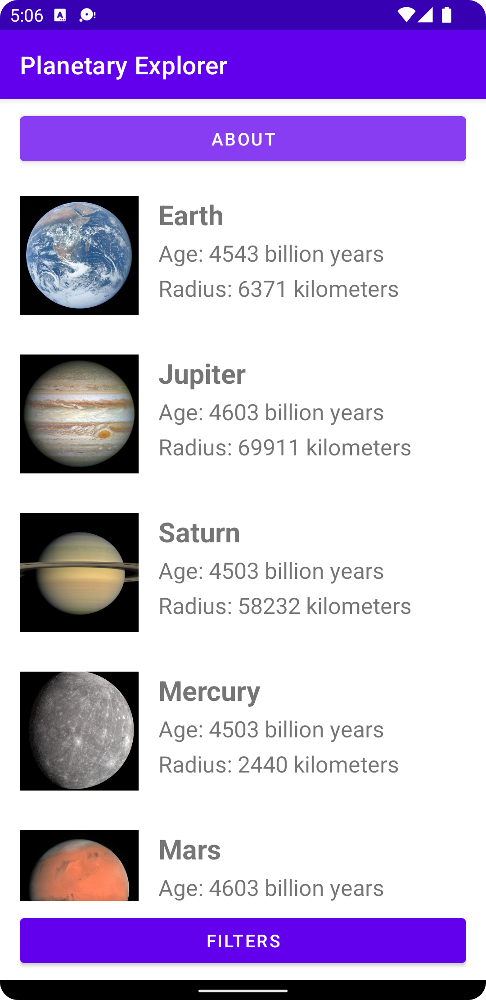
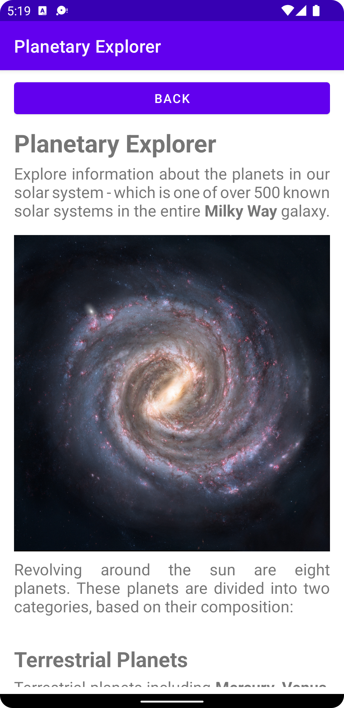
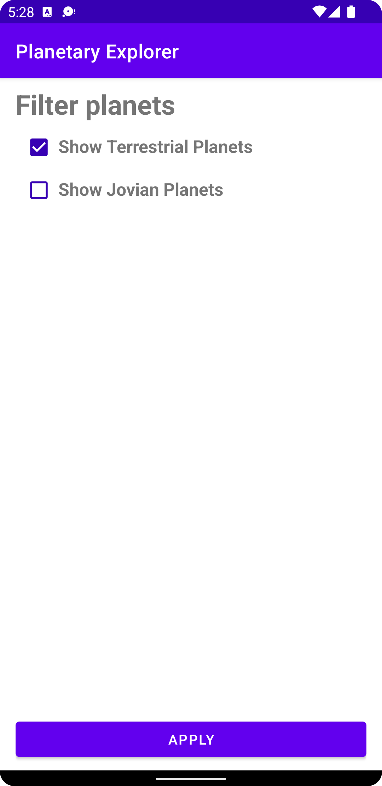

# Report

This project presents a list of all the planets in our solar system, where each planet constitutes an item within a `RecyclerView`. For every planet in that list, there are multiple pieces of information that describe its attributes.

The data for each planet is not stored within the application itself, but is instead retrieved from an [API endpoint](https://mobprog.webug.se/json-api?login=b21mihpa) that returns JSON formatted data. To minimze network requests, the data is only retrieved once when the application is launched, and then passed on to other activities as intents.

There are three static views within the application; one for the `AboutActivity`, another for the `FilterActivity`, and a third for the `MainActivity`. These views are, more or less, hardcoded to always contain the same data. However, there is also a dynamic view to render data about a specific planet onto the screen, the `PlanetActivity`.

## PlanetActivity

Each item in the `RecyclerView` is a clickable target, as can be seen from the method that wraps the code for the intent.

```java
@Override
public void onPlanetClick(int position) {
    final Intent intent = new Intent(this, PlanetActivity.class);
    intent.putExtra("imageUrl", planets.get(position).imageUrl);
    intent.putExtra("name", planets.get(position).name);
    intent.putExtra("location", planets.get(position).location);
    intent.putExtra("category", planets.get(position).category);
    intent.putExtra("radius", planets.get(position).radius);
    intent.putExtra("age", planets.get(position).age);
    startActivity(intent);
}
```

This method receives the position of the item that was clicked, so that any requested data can be passed onto `PlanetActivity`. This method is actually an interface within `PlanetAdapter`, where the `PlanetViewHolder` class implements `View.OnClickListener`.

```java
public interface OnPlanetClickListener {
    void onPlanetClick(int position);
}
```

It is through the `onClick` method that `onPlanetClick` is triggered.

```java
@Override
public void onClick(View view) {
    onPlanetClickListener.onPlanetClick(getAdapterPosition());
}
```

Note how the listener is attached to the `PlanetViewHolder` as a whole.

```java
public PlanetViewHolder(@NonNull View itemView, OnPlanetClickListener onPlanetClickListener) {
    super(itemView);

    this.onPlanetClickListener = onPlanetClickListener;
    itemView.setOnClickListener(this);
}
```

<p align="center">
  
</p>

## Glide

To download an image from an external URL is not a trivial task. Therefore, a third-party library is used to do just that. **Glide** will receive the appropriate context, an external link to the resource, and a reference to the widget where the image should be mounted.

```java
public void onBindViewHolder(@NonNull PlanetAdapter.PlanetViewHolder holder, int position) {
    Glide.with(context).load(planets.get(position).imageUrl).into(holder.planetImage);
}
```

This will retrieve the image in an asynchronous manner, so that the image can be displayed when it has been fully downloaded, while the rest of the program continues.

## FilterActivity

There are no more than eight planets in our solar system, but imagine for a second that there were more than a hundred. It would not be very practical to scroll down the list just to find that one planet of interest. That is why there should be a way to search for or filter data based on certain parameters. Now, this application does not include a search function, but there is a way to filter data. Not only that. The application remembers the filters that were applied through `SharedPreferences`.

```java
final SharedPreferences sharedPreferences = getSharedPreferences("store", MODE_PRIVATE);
final SharedPreferences.Editor editor = sharedPreferences.edit();
```

Whenever these filters change, so does the data for that shared preference.

```java
final CheckBox checkboxTerrestrialPlanets = findViewById(R.id.checkbox_terrestrial_planets);
checkboxTerrestrialPlanets.setChecked(sharedPreferences.getBoolean("show_terrestrial_planets", true));
checkboxTerrestrialPlanets.setOnClickListener(view -> editor.putBoolean("show_terrestrial_planets", checkboxTerrestrialPlanets.isChecked()));
```

These filters can then be applied in other activities, such as in `MainActivity`, where the list of planets is modified, before notifying the `RecyclerView.Adapter` of this change.

```java
private void applyFilter() {
    final SharedPreferences sharedPreferences = getSharedPreferences("store", MODE_PRIVATE);

    if (!sharedPreferences.getBoolean("show_terrestrial_planets", true)) {
        planets.removeIf(planet -> planet.category.equals("terrestrial"));
    }

    if (!sharedPreferences.getBoolean("show_jovian_planets", true)) {
        planets.removeIf(planet -> planet.category.equals("jovian"));
    }

    planetAdapter.notifyDataSetChanged();
}
```

# Summary

The theme of this application revolves around the planets in our solar system. The reason behind this is very simple; this information is not deemed intellectual property.

Besides the list of all eight planets, there are two buttons to navigate away from the home screen, as can be seen below:

<p align="center">
  
</p>

## About

This button will launch another activity that presents general information about the application, but also explains two pivotal concepts, namely [Terrestrial Planets](https://en.wikipedia.org/wiki/Terrestrial_planet) and [Jovian Planets](https://en.wikipedia.org/wiki/Giant_planet). These concepts are relevant because they are used to filter the list of planets.

<p align="center">
  
</p>

## Filters

It is possible to filter planets based on category. Any planet in our solar system is either a _Terrestrial Planet_ or a _Jovian Planet_. It just so happens to split evenly, which means that each filter affects half of the total list of planets.

<p align="center">
  
</p>

From a user's perspective, there really is not much more to it. Of course, there are many intermediary steps between the data received from the [API endpoint](https://mobprog.webug.se/json-api?login=b21mihpa) and the layout of the application, but those are implementation details that this report cannot cover. The source code is, however, available in this repository.
